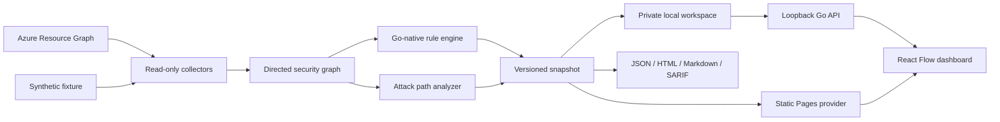

# CloudThreat Atlas

> Turn Azure resources into an interactive attack graph.

[](https://github.com/meneeses/cloudthreat-atlas/actions/workflows/ci.yml)
[](https://meneeses.github.io/cloudthreat-atlas/)
[](LICENSE)

CloudThreat Atlas is a local-first, read-only cloud security workspace written
in Go and React. It turns Azure resources, identities, network exposure, and
permissions into an explainable graph, then keeps point-in-time snapshots so
you can investigate, compare, triage, and safely plan remediation.

The public demo uses a fully synthetic healthcare company named **Contoso Health**. No Azure account, paid service, or real infrastructure is required.

## Live demo

Explore the static, zero-cost demo at **https://meneeses.github.io/cloudthreat-atlas/**.


_The zero-cost Pages mode is shown above; the local engine uses the same interface and adds private workspace capabilities._

The public demo includes:

- an interactive resource and identity graph;
- severity, resource type, and text filters;
- three narrated attack paths;
- findings with evidence and practical remediation;
- what-if remediation simulations;
- a responsive SOC-inspired interface.

## Quick start

Prerequisites: Go 1.27+, Node.js 24+, and npm 12+.

```bash
git clone https://github.com/meneeses/cloudthreat-atlas.git
cd cloudthreat-atlas
make demo
```

Then open `http://localhost:8080`.

The dashboard is embedded in the Go executable. After cloning once, an
ordinary `go build -o atlas ./cmd/atlas` produces a self-contained binary. Use
`atlas app` for the private persistent workspace or `atlas demo` for the
stateless synthetic scenario; `--web-dir` remains available as a development
override.

### Local workspace

```bash
# Build once and start the private workspace
go build -o atlas ./cmd/atlas
./atlas app

# Import an existing portable snapshot
./atlas import --input demo/contoso-health.json
```

`atlas app` and `atlas demo` bind only to loopback; the persistent app also
opens the browser locally. Catalog data is stored in a private SQLite database
and each immutable snapshot is stored as checksummed, compressed JSON.
The persistent app prints an authenticated launch URL. Its process-scoped
session credential is carried in the URL fragment, removed from the address
bar by the dashboard, held only in browser memory, and required on every local
workspace API request. Reopen the printed URL after refreshing or opening a
new tab. The synthetic `atlas demo` remains credential-free.
Override the OS data directory with `--data-dir` or
`CLOUDTHREAT_ATLAS_HOME` when you need an isolated workspace.

## Commands

```bash
# Start the persistent local application
go run ./cmd/atlas app

# Serve only the synthetic demo
go run ./cmd/atlas demo

# Analyze a local snapshot
go run ./cmd/atlas analyze --input demo/contoso-health.json

# Export a report
go run ./cmd/atlas report --input demo/contoso-health.json --format markdown

# Scan an existing Azure subscription in read-only mode and create a share-safe snapshot
go run ./cmd/atlas scan azure --subscription <subscription-id> --redact --output azure-scan.local.json

# Save a real scan into local history as well as exporting it
go run ./cmd/atlas scan azure --subscription <subscription-id> --save --output azure-scan.local.json

# Explore history and compare two point-in-time snapshots
go run ./cmd/atlas snapshots list
go run ./cmd/atlas compare <base-snapshot-id> <target-snapshot-id>

# Generate a review-only remediation bundle; nothing is executed
go run ./cmd/atlas bundle --snapshot <snapshot-id> --output remediation.zip

# Check workspace permissions, integrity, and interrupted jobs
go run ./cmd/atlas doctor
```

Run the frontend separately during development:

```bash
cd web
npm install
npm run dev
```

## Architecture



The static GitHub Pages site and local API share the same snapshot contract.
The local workspace adds history, comparison, triage, bounded graph views, and
cancelable scan jobs without changing portable snapshots. Store manual exports
under `data/`, `scans/`, or a `*.local.json`/`*.scan.json` filename so Git
ignores them.

API snapshots with more than 500 resources or 2,000 relationships open as an
attack-path-prioritized slice. The dashboard reports the loaded and total
counts, while the complete immutable snapshot remains available in the local
workspace. Snapshot history is grouped by derived environment, and comparisons
are offered only within the active environment.

The exported Go contracts are available from `github.com/meneeses/cloudthreat-atlas`; the CLI and internal engines use those same types without exposing implementation details.

Read the [architecture overview](docs/architecture/overview.md) for the trust boundaries and data flow.

## Safety and cost principles

- Read-only by design; CloudThreat Atlas never remediates or exploits resources.
- Secret values are never queried. Resource names and Azure object identifiers are collected locally for graph analysis and can be deterministically removed with `--redact` before sharing.
- The complete demo and development workflow cost nothing.
- GitHub Pages is the only required public hosting.
- Azure integration analyzes an existing subscription and does not deploy infrastructure.
- Any future hosted SaaS will be designed, budgeted, and operated separately.
- Generated remediation bundles contain commented examples and review steps;
  Atlas never executes them.

### Sharing a scan safely

Raw Azure metadata can contain subscription IDs, resource IDs, identity object IDs, organization-specific resource names, and structured evidence. Use `--redact` when producing a snapshot for an issue, portfolio example, or teammate. Redaction keeps graph references stable while replacing tenant-specific identifiers, generalizing custom-role names, and removing structured evidence and sensitive metadata fields.

The first Azure collector recognizes a conservative set of built-in RBAC
capabilities for Owner, Contributor, User Access Administrator, Storage Blob
Data Contributor, and Key Vault Secrets User. It also evaluates a small,
explicit allowlist of security-relevant actions in custom roles, including
their exclusions. Unknown roles and unrecognized capabilities remain visible
in the graph but are not guessed to be exploitable.

See [COSTS.md](COSTS.md) for the permanent zero-cost policy and [SECURITY.md](SECURITY.md) for responsible disclosure.

## Development

```bash
make setup
make test
make verify
```

Maintainers can run `make maintainer-setup` once to activate the local Git hooks
that protect the personal author identity, then use `make verify-maintainer`.
The generic verification targets remain usable from contributor forks.
Contributors are welcome; see [CONTRIBUTING.md](CONTRIBUTING.md).

## Roadmap

- [x] Synthetic attack graph and public static demo
- [x] Go domain model, analysis engine, API, CLI, and reports
- [x] Story Mode and remediation simulation
- [x] Read-only Azure Resource Graph collector for the first supported resource set
- [x] Private local workspace, historical snapshots, comparison, and triage
- [x] Bounded attack-path discovery and review-only remediation bundles
- [ ] Live validation of the expanded Azure collector in an authorized test subscription
- [ ] Optional policy packs and richer Microsoft Entra analysis

The detailed roadmap lives in [docs/ROADMAP.md](docs/ROADMAP.md). Performance
budgets and scale fixtures are documented in
[docs/PERFORMANCE.md](docs/PERFORMANCE.md).

## License

Copyright 2026 Joao Meneses. Licensed under the [Apache License 2.0](LICENSE).
Dependency attributions are documented in
[THIRD_PARTY_NOTICES.md](THIRD_PARTY_NOTICES.md).
