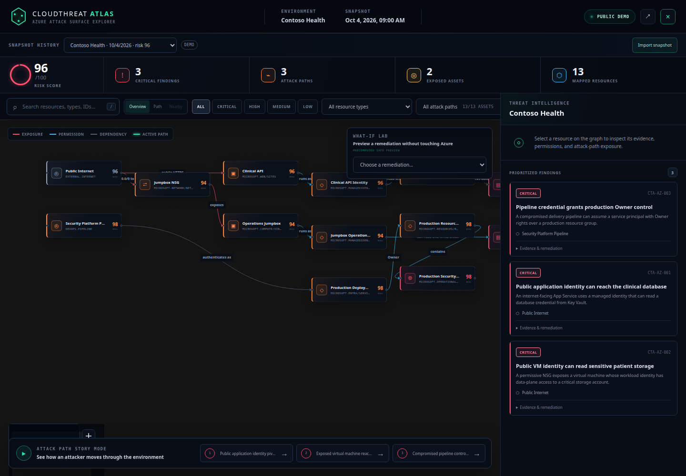
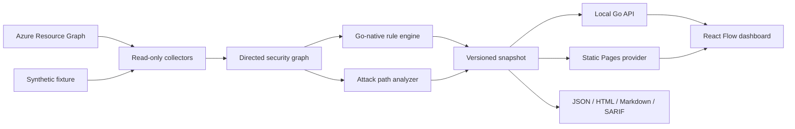

# CloudThreat Atlas

> Turn Azure resources into an interactive attack graph.

[](https://github.com/meneeses/cloudthreat-atlas/actions/workflows/ci.yml)
[](https://meneeses.github.io/cloudthreat-atlas/)
[](LICENSE)

CloudThreat Atlas is a read-only cloud security explorer written in Go and React. It turns Azure resources, identities, network exposure, and permissions into an explainable graph, then highlights the attack paths that matter.

The public demo uses a fully synthetic healthcare company named **Contoso Health**. No Azure account, paid service, or real infrastructure is required.

## Live demo

Explore the static, zero-cost demo at **https://meneeses.github.io/cloudthreat-atlas/**.



_Local engine mode is shown above; the Pages build presents the same graph from its bundled synthetic fixture._

The demo includes:

- an interactive resource and identity graph;
- severity, resource type, and text filters;
- three narrated attack paths;
- findings with evidence and practical remediation;
- what-if remediation simulations;
- a responsive SOC-inspired interface.

## Quick start

Prerequisites: Go 1.27+, Node.js 24+, and npm 12+.

```bash
git clone https://github.com/meneeses/cloudthreat-atlas.git
cd cloudthreat-atlas
make demo
```

Then open `http://localhost:8080`.

The dashboard is embedded in the Go executable. After cloning once, an
ordinary `go build -o atlas ./cmd/atlas` produces a self-contained binary that
can run `atlas demo` from any directory; `--web-dir` remains available as a
development override.

## Commands

```bash
# Serve the embedded dashboard with the local API
go run ./cmd/atlas demo

# Analyze a local snapshot
go run ./cmd/atlas analyze --input demo/contoso-health.json

# Export a report
go run ./cmd/atlas report --input demo/contoso-health.json --format markdown

# Scan an existing Azure subscription in read-only mode and create a share-safe snapshot
go run ./cmd/atlas scan azure --subscription <subscription-id> --redact --output azure-scan.local.json
```

Run the frontend separately during development:

```bash
cd web
npm install
npm run dev
```

## Architecture



The static GitHub Pages site and local API share the same snapshot contract. Store raw scans under `data/`, `scans/`, or a `*.local.json`/`*.scan.json` filename so Git ignores them.

The exported Go contracts are available from `github.com/meneeses/cloudthreat-atlas`; the CLI and internal engines use those same types without exposing implementation details.

Read the [architecture overview](docs/architecture/overview.md) for the trust boundaries and data flow.

## Safety and cost principles

- Read-only by design; CloudThreat Atlas never remediates or exploits resources.
- Secret values are never queried. Resource names and Azure object identifiers are collected locally for graph analysis and can be deterministically removed with `--redact` before sharing.
- The complete demo and development workflow cost nothing.
- GitHub Pages is the only required public hosting.
- Azure integration analyzes an existing subscription and does not deploy infrastructure.
- Any future hosted SaaS will be designed, budgeted, and operated separately.

### Sharing a scan safely

Raw Azure metadata can contain subscription IDs, resource IDs, identity object IDs, and organization-specific resource names. Use `--redact` when producing a snapshot for an issue, portfolio example, or teammate. Redaction keeps graph references stable while replacing tenant-specific identifiers and removing sensitive metadata fields.

The first Azure collector recognizes a conservative set of built-in RBAC capabilities for Owner, Contributor, User Access Administrator, Storage Blob Data Contributor, and Key Vault Secrets User. Unknown or custom roles remain visible in the graph but are not assumed exploitable until their actions can be evaluated safely.

See [COSTS.md](COSTS.md) for the permanent zero-cost policy and [SECURITY.md](SECURITY.md) for responsible disclosure.

## Development

```bash
make setup
make test
make verify
```

The repository includes local Git hooks that protect the maintainer's personal author identity and prevent accidental company attribution. Contributors are welcome; see [CONTRIBUTING.md](CONTRIBUTING.md).

## Roadmap

- [x] Synthetic attack graph and public static demo
- [x] Go domain model, analysis engine, API, CLI, and reports
- [x] Story Mode and remediation simulation
- [x] Read-only Azure Resource Graph collector for the first supported resource set
- [ ] Scan comparison and historical snapshots
- [ ] Optional policy packs and richer identity analysis

The detailed roadmap lives in [docs/ROADMAP.md](docs/ROADMAP.md).

## License

Copyright 2026 Joao Meneses. Licensed under the [Apache License 2.0](LICENSE).
Dependency attributions are documented in
[THIRD_PARTY_NOTICES.md](THIRD_PARTY_NOTICES.md).
